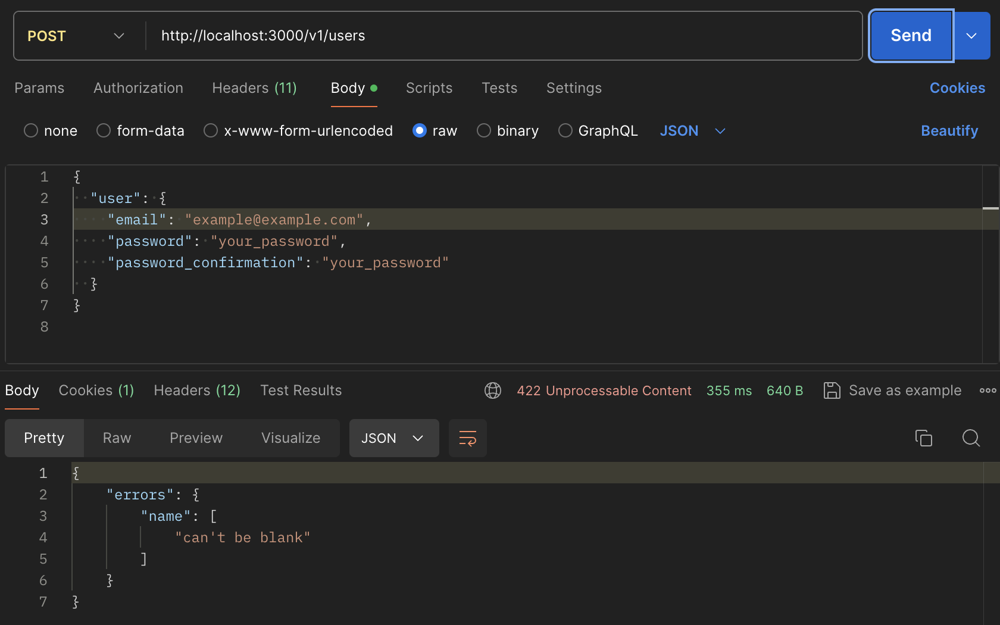
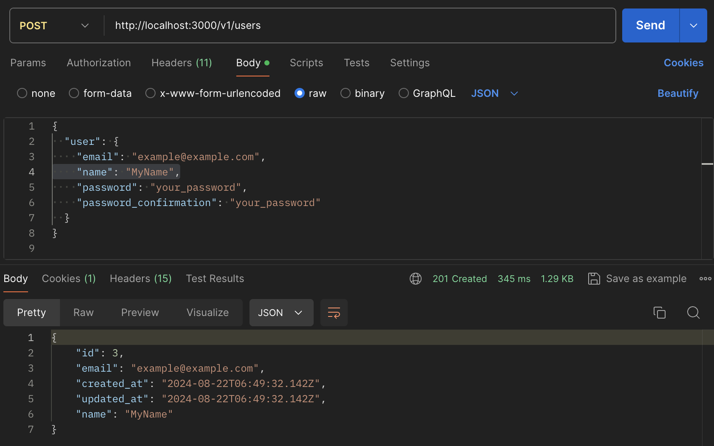
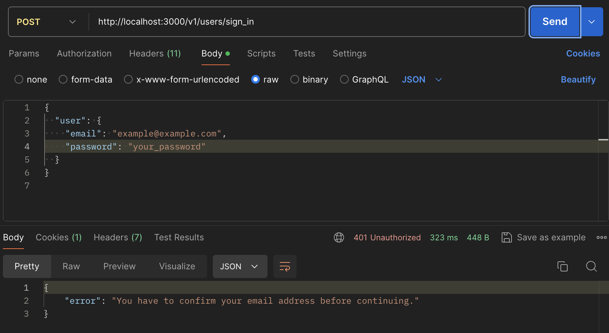
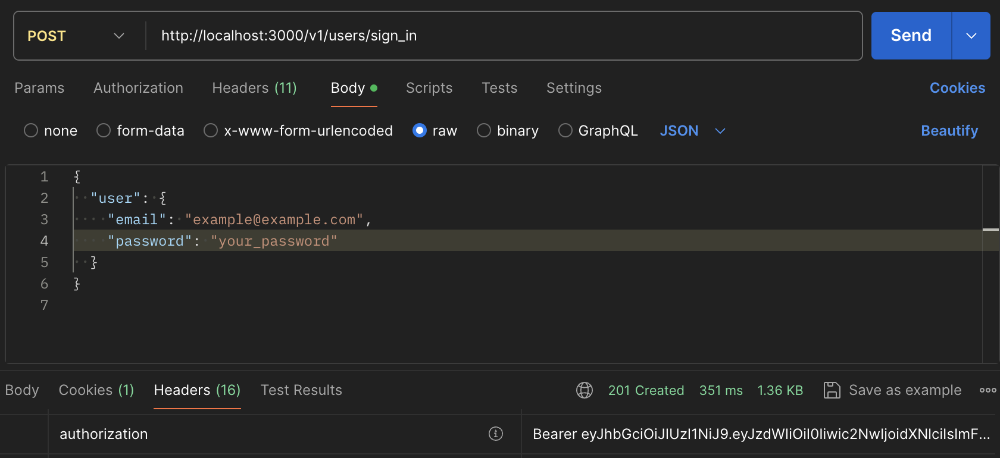
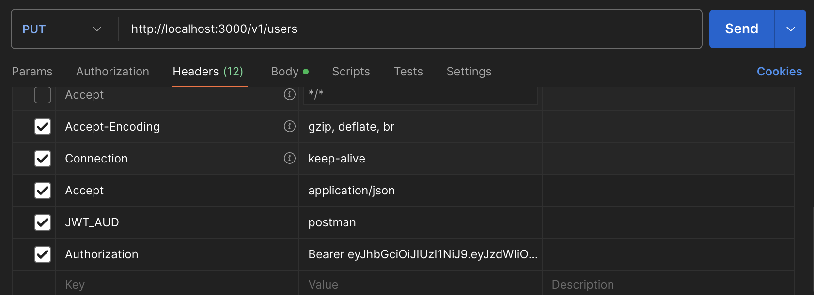
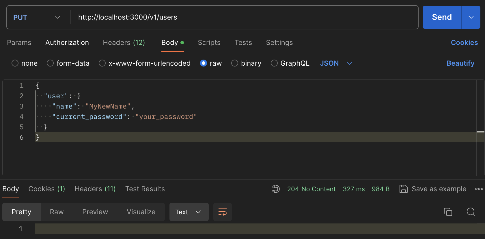

# Rails 7 API-only Setup with Devise & Devise JWT

This is a template of a Rails 7 API-only setup with Devise (confirmable) & Devise JWT (AllowList revocation strategy + AUD claim). Highly recommend reading articles on JWT revocation from [Devise JWT](https://github.com/waiting-for-dev/devise-jwt).

Additionally, this API has a custom Devise User param (`:name`) and namespacing-like routes (`/v1/users/...`) for **default** Devise controllers. If you don't want this, browse the previous commit on main.

I'm using [rbenv](https://github.com/rbenv/rbenv) as my ruby env manager and [rbenv-gemset](https://github.com/jf/rbenv-gemset) extension to create collections of gems.

To set this up from scratch:

### Create a new API-only Rails project

```bash
brew upgrade ruby-build  # On MacOS to update the Ruby versions list
rbenv install 3.3.4
rbenv global 3.3.4

gem install rails

rails new my_app --api --database=postgresql --skip-test  # Don't forget to add your preferred options
```

### Setup CORS

1. Uncomment `gem "rack-cors"` in `Gemfile`

2. `bundle install`

3. Uncomment CORS config in `cors.rb`. For dev purposes, let any connection through:

```rb
Rails.application.config.middleware.insert_before 0, Rack::Cors do
  allow do
    origins "*"

    resource "*",
      headers: :any,
      methods: [ :get, :post, :put, :patch, :delete, :options, :head ]
  end
end
```

### Setup [Devise](https://github.com/heartcombo/devise)

1. `bundle add devise`

2. `rails generate devise:install`

3. Add the following line to `development.rb`:

```rb
config.action_mailer.default_url_options = { host: 'localhost', port: 3000 }
```

4. `rails generate devise User`

5. Uncomment the "Confirmable" section in the `devise_create_users.rb` migration.

6. `rails db:create db:migrate`

7. Follow these:

   1. https://github.com/waiting-for-dev/devise-jwt/wiki/Configuring-devise-for-APIs#responding-to-json
   2. https://github.com/waiting-for-dev/devise-jwt/wiki/Configuring-devise-for-APIs#defaulting-to-json-as-format

8. Add `devise :confirmable` to the `User` model.

9. Use [letter_opener](https://github.com/ryanb/letter_opener) to open confirmation letters in development (follow the link for instructions).

### Setup [Devise JWT](https://github.com/waiting-for-dev/devise-jwt)

1. `bundle add devise-jwt`

2. Generate a secret: `rails secret`

3. `EDITOR="code --wait" rails credentials:edit`:

```yml
devise_jwt_secret_key: <your_secret>
```

**Note!** Devise JWT devs [encourage](https://github.com/waiting-for-dev/devise-jwt?tab=readme-ov-file#secret-key-configuration) to use a secret different from the `secret_key_base`.

4. Add the config to `devise.rb`:

```rb
Devise.setup do |config|
  # ...
  config.jwt do |jwt|
    jwt.secret = Rails.application.credentials.devise_jwt_secret_key!
  end
end
```

5. Create `allowlisted_jwts` table:

`rails g migration create_allowlisted_jwts`:

```rb
def change
  create_table :allowlisted_jwts do |t|
    t.string :jti, null: false
    t.string :aud, null: false
    t.datetime :exp, null: false
    t.references :user, foreign_key: { on_delete: :cascade }, null: false  # user singular (!)
  end

  add_index :allowlisted_jwts, :jti, unique: true
end
```

`rails db:migrate`

6. Create `AllowlistedJwt` model:

```rb
class AllowlistedJwt < ApplicationRecord
end
```

7. Include JWT in `User`:

```rb
class User < ApplicationRecord
  include Devise::JWT::RevocationStrategies::Allowlist

  devise ...
         :jwt_authenticatable, jwt_revocation_strategy: self
end
```

8. Add the `aud_header` config to `devise.rb`:

```rb
Devise.setup do |config|
  # ...
  config.jwt do |jwt|
    ...
    jwt.aud_header = "JWT_AUD"  # Change to the preferred one
  end
end
```

**This header needs to be in your request headers**, or else there's going to be an error:

`ActiveRecord::NotNullViolation (PG::NotNullViolation: ERROR:  null value in column "aud" of relation "allowlisted_jwts" violates not-null constraint)`

## Adding custom permitted params to Devise

1. `rails g migration add_name_to_users`:

```rb
def change
  add_column :users, :name, :string, null: false  # Use preferred options
end
```

`rails db:migrate`

2. Add a validation to User if you choose to have a `null: false` param:

`user.rb`

```rb
class User < ApplicationRecord
  ...
  validates_presence_of :name
end
```

3. Configure Devise permitted params:

`application_controller.rb`

```rb
class ApplicationController < ActionController::API
  ...
  before_action :configure_permitted_parameters, if: :devise_controller?

  def configure_permitted_parameters
    devise_parameter_sanitizer.permit(:sign_up, keys: [ :name ])
    devise_parameter_sanitizer.permit(:account_update, keys: [ :name ])
  end
end
```

## "Namespacing" default Device controllers

`routes.rb`

```rb
  # Before: devise_for :users, defaults: { format: :json }
  devise_for :users, defaults: { format: :json }, path: "v1/users"
```

This way, the routes change in a namespacing-like manner but with no hustle about the actual namespacing consequences, like, for example, changes in [`resourse_name`s](https://github.com/heartcombo/devise/issues/3663#issuecomment-169130536) or controller methods.

See, for example, an excerpt from the [`#devise_for` docs](https://www.rubydoc.info/gems/devise/2.2.8/ActionDispatch/Routing/Mapper#devise_for-instance_method) (`:module` option):

> Also pay attention that when you use a namespace it will affect all the helpers and methods for controllers
> and views. For example, using the above setup you'll end with following methods:
> current_publisher_account, authenticate_publisher_account!, publisher_account_signed_in, etc.

## Testing with Postman

`rails s`

Don't forget the `JWT_AUD` header. I set it to `postman`.






Before running this, click the confirmation link in the `letter_opener` letter in your browser.


Copy the Authorization header value ("Bearer ...") and paste with the next request.




## Issues and Discussions

You're welcome to file an issue or share some thoughts in discussions.
